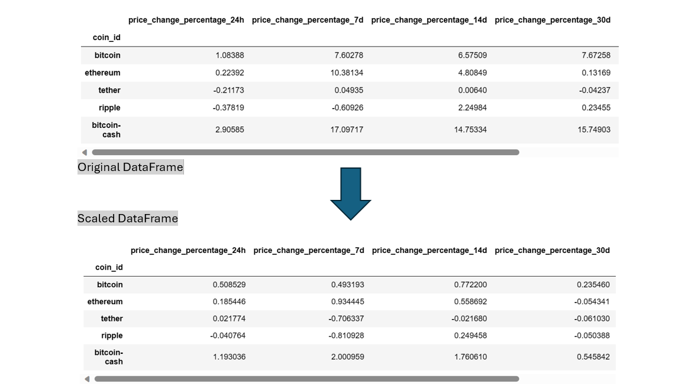

# CryptoClustering

### Prepare the Data
In this challenge, first I prepared the data by using the `StandardScaler()` module from `scikit-learn` to normalize the data from the CSV file. Then Created a DataFrame with the scaled data and set the "coin_id" index from the original DataFrame as the index for the new DataFrame.

---

#### Find the Best Value for k Using the Original Scaled DataFrame
Used the elbow method to find the best value for k

#### Cluster Cryptocurrencies with K-means Using the Original Scaled Data
Cluster the cryptocurrencies for the best value for k on the original scaled data. Then created a scatter plot using `hvPlot.`

---

### Optimize the Clusters with Principal Component Analysis
Using the original scaled DataFrame, performed a PCA and reduced the features to three principal components.
Created a new DataFrame with the PCA data and set the "coin_id" index from the original DataFrame as the index for the new DataFrame.

---

#### Find the Best Value for k Using the PCA Data
Used the elbow method on the PCA data to find the best value for k

#### Cluster Cryptocurrencies with K-means Using the PCA Data
cluster the cryptocurrencies for the best value for k on the PCA data. Then created a scatter plot using `hvPlot.`

---

### Visualize and Compare the Results

