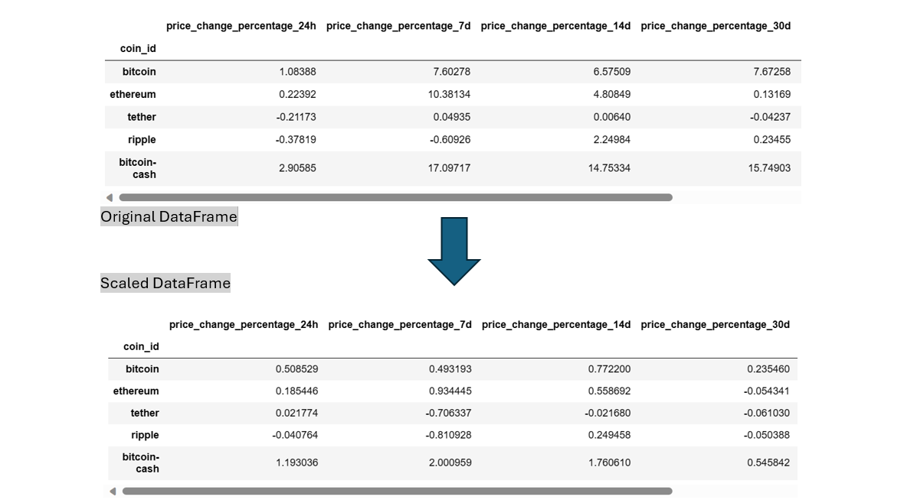

# CryptoClustering

In this challenge, first I prepared the data by using the `StandardScaler()` module from `scikit-learn` to normalize the data from the CSV file. Then Created a DataFrame with the scaled data and set the "coin_id" index from the original DataFrame as the index for the new DataFrame.

### Find the Best Value for k Using the Original Scaled DataFrame

### Cluster Cryptocurrencies with K-means Using the Original Scaled Data

### Optimize the Clusters with Principal Component Analysis

### Find the Best Value for k Using the PCA Data

### Cluster Cryptocurrencies with K-means Using the PCA Data